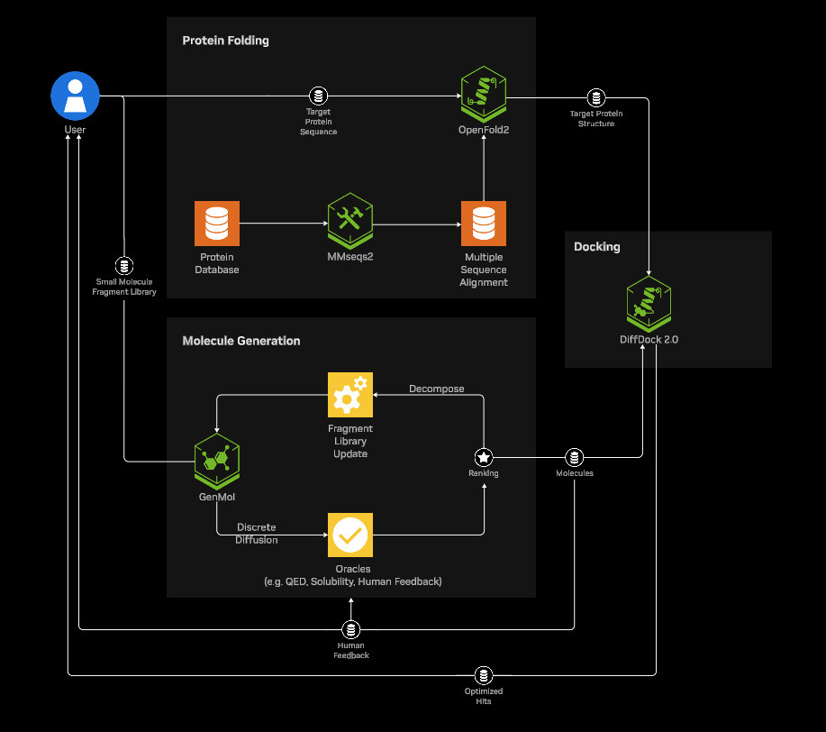

<h2>NVIDIA BioNeMo Blueprint: Generative Virtual Screening for Drug Discovery</h2>

<hr>

Use the following documentation to learn about the NVIDIA Generative Virtual Screening Blueprint.

- [Overview](#overview)
- [What's New](#whats-new)
- [Get Started](#get-started)
- [System Requirements](#system-requirements)
- [Additional Documentation](#additional-documentation)

## Overview



The NVIDIA BioNeMo Blueprint for generative virtual screening shows how generative AI and accelerated BioNeMo NIMs (NVIDIA Inference Microservices) can be used to design optimized small molecules smarter and faster. This Blueprint creates a streamlined virtual screening workflow for drug discovery. It highlights the use of cutting-edge generative AI models and GPU-accelerated microservices to predict protein structures, generate optimized molecules, and perform protein-ligand docking.

The workflow is applied to the SARS-CoV-2 main protease and Nirmatrelvir as an example, but it is highly flexible and can be adapted to any protein or molecule of interest. By combining these models, the notebook showcases the power of NVIDIA’s BioNeMo NIMs in accelerating drug discovery through AI-driven insights and predictions.

## Software Components
Here’s an overview of the key NVIDIA NIMs featured in this workflow:
- **MSA-Search (MMSeqs2)**: A GPU-accelerated toolkit for multiple sequence alignment, providing co-evolutionary information crucial for accurate protein structure prediction.
- **OpenFold2**: A transformer-based generative model for predicting 3D protein structures from amino acid sequences, leveraging MSA data to enhance structural accuracy.
- **GenMol**: A masked diffusion model designed for molecular generation and optimization, enabling the creation of drug-like molecules tailored to specific chemical properties.
- **DiffDock**: A state-of-the-art generative model for protein-ligand docking that predicts binding poses without requiring predefined binding pockets, facilitating blind docking.


## What's New ?
- MSA-Search (MMSeqs2) was extracted from the AlphaFold2 NIM to serve as an independent, GPU-accelerated tool for generating multiple sequence alignments, enhancing flexibility and performance in protein structure prediction workflows.
- We swapped AlphaFold2 NIM with OpenFold2 NIM- a reproduction of AlphaFold2 that achieves similar accuracy but offers significant performance improvements when integrated into the BioNeMo platform. It is accelerated by up to 6x on NVIDIA GPUs, enabling faster predictions and larger-scale experiments.
- GenMol (replaces MolMIM) applies a fragment-based scheme of generation, allowing for a controlled generation with desired molecular fragments (i.e., motif or scaffold) being kept during the optimization loops.
- DiffDock V2 offers batch-docking to more efficiently dock multiple molecules to the same receptor concurrently and largely improved docking accuracy by the in-house model trained with PLINDER dataset.

## Hardware Requirements

The following specifications are required:
- At least 1300 GB (1.3 TB) of fast NVMe SSD space. (For MSA databases)
- A modern CPU with at least 24 CPU cores
- At least 64 GB of RAM
- 4 X NVIDIA L40s, A100, or H100 GPUs across your cluster.

## Get Started
Deploy the blueprint using [Helm](./generative-virtual-screening-chart/)

```bash
# Launch the Jupyter notebook
cd src/
jupyter notebook
```

* [Helm Deployment](./generative-virtual-screening-chart/)
* [Notebook](./src/)

## Notebook

An example of how to call each generative virtual screening step is located in `src/generative-virtual-screening.ipynb`.

## Additional Documentation

You can try this Blueprint and find its Blueprint Card on [build.nvidia.com/nvidia/generative-virtual-screening-for-drug-discovery](https://build.nvidia.com/nvidia/generative-virtual-screening-for-drug-discovery)
